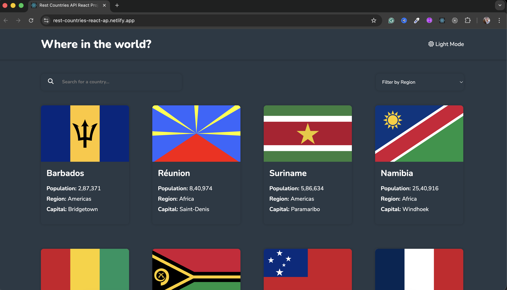
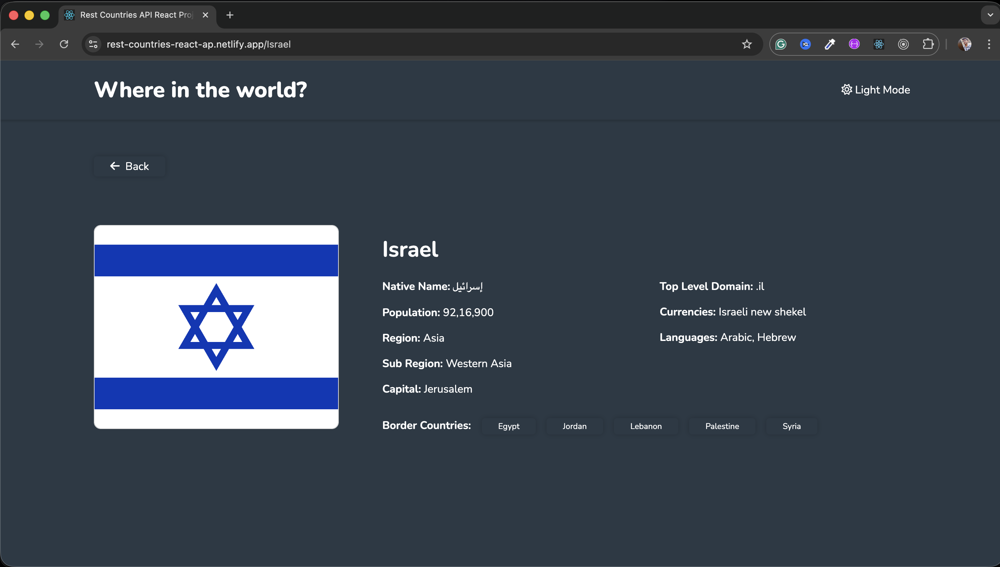

# REST Countries Explorer

A React-based web application that allows users to explore country data using the REST Countries API. 
The application supports dynamic routing, search filtering, and skeleton loading states for improved user experience.

## 🔗 Live Demo

[Live Site](https://rest-countries-react-ap.netlify.app/)

## 🛠 Tech Stack

- React
- React Router (Dynamic Routing)
- REST Countries API
- CSS 
- JavaScript (ES6+)
- parcel

## ✨ Features

- Fetches country data from REST Countries API
- Dynamic routing for individual country detail pages
- Search functionality to filter countries
- Skeleton loading effect while data is being fetched
- Responsive UI for mobile and desktop
- Error state handling for failed API requests

## 🧠 Key Implementation Details

- Implemented dynamic routes using React Router
- Used conditional rendering to manage loading and error states
- Designed reusable components for better scalability
- Optimized UI rendering for smoother user experience

## 📦 Installation

1. Clone the repository

git clone https://github.com/sumanth-git-hub/rest-countries-api-project.git

2. Navigate into the project directory

cd project-name

3. Install dependencies

npm install

4. Start the development server

npm run dev

## 📸 Screenshots

## 📸 Screenshots

## 📌 What I Learned

- Managing asynchronous data fetching in React
- Handling loading and error states effectively
- Implementing dynamic routing
- Improving UX with skeleton loading patterns

